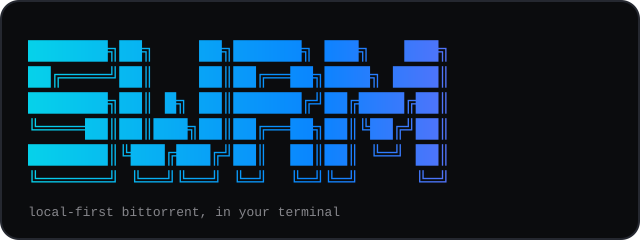
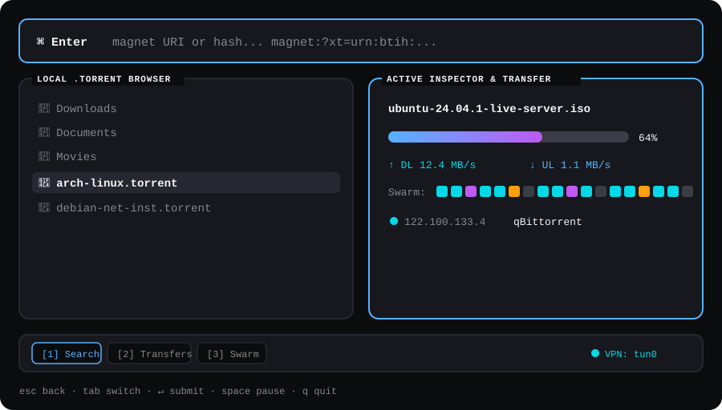

<p align="center"></p>

<p align="center">
  <a href="https://www.npmjs.com/package/@manasvinyadav000/swrm"></a>
  <a href="https://github.com/ManasvinYadav/swrm/releases"></a>
  <a href="./LICENSE"></a>
  
</p>

`swrm` is a keyboard-driven BitTorrent client that lives entirely in your terminal. There
is no built-in search or indexer — you bring a magnet URI, an infohash, or a local
`.torrent` file, and `swrm` does the rest: metadata resolution, per-file download
selection, and a live swarm dashboard.

## Contents

- [Features](#features)
- [Requirements](#requirements)
- [Install](#install)
- [Quick look](#quick-look)
- [Keybindings](#keybindings)
- [Configuration](#configuration)
- [Troubleshooting](#troubleshooting)
- [How it works](#how-it-works)
- [Development](#development)
- [Releasing (maintainers)](#releasing-maintainers)
- [Security](#security)
- [License](#license)

## Features

- **Local-first, always.** Paste a `magnet:?xt=urn:btih:...` URI, a bare 40-char hex /
  32-char Base32 infohash, or browse to a `.torrent` file on disk. No bundled indexers,
  no telemetry, no network calls beyond DHT/trackers/peers.
- **VPN kill-switch.** Point `swrm` at a specific network interface (e.g. `tun0`, `wg0`)
  and every socket — peers, trackers, DHT — is bound to it. If the interface drops,
  `swrm` halts all transfer activity immediately rather than leaking your real IP.
- **Multi-torrent, one dashboard.** Add several torrents; switch which one is
  "highlighted" with the arrow keys and a slim switcher strip appears automatically.
- **Real pause/resume**, per torrent — not a rate-limit hack.
- **Per-file selection and priority.** Once a torrent's metadata resolves, pick exactly
  which files to download and set each one to Low, Normal, or High priority — everything
  else is skipped outright, not just downloaded last.
- **A dashboard that stays out of your way.** One persistent screen — magnet input, file
  browser, transfer inspector — with a 3-stop keyboard focus cycle instead of buried
  menus.

## Requirements

- **Prebuilt binaries** (npm, or downloaded directly from
  [Releases](https://github.com/ManasvinYadav/swrm/releases)): macOS (arm64/amd64), Linux
  (amd64/arm64), or Windows (amd64). Nothing else to install — the npm package's
  `postinstall` step just downloads the matching one.
- **Building from source**: Go 1.27+.

## Install

**npm (recommended — installs a prebuilt binary, no Go toolchain required):**

```sh
npm install -g @manasvinyadav000/swrm
swrm
```

**Or run it on demand without installing anything:**

```sh
npx @manasvinyadav000/swrm
```

**From source** (requires Go 1.27+):

```sh
git clone https://github.com/ManasvinYadav/swrm.git
cd swrm
go build -o swrm ./cmd/swrm
./swrm
```

### Uninstall

```sh
npm uninstall -g @manasvinyadav000/swrm
```

This also removes the downloaded binary under the package's own `dist/` directory. If you
built from source, just delete the `swrm` binary you built and, optionally,
`~/.config/swrm/config.yaml`.

## Quick look

<p align="center"></p>

## Keybindings

| Key                | Action                                                          |
| ------------------ | ---------------------------------------------------------------- |
| `Tab` / `Shift+Tab` | Cycle keyboard focus: magnet input → file browser → inspector |
| `↑` / `↓`           | Same 3-way focus cycle as Tab/Shift+Tab (disabled while the file browser has focus, since it needs ↑/↓ for its own list navigation) |
| `1`                 | Jump focus to the magnet input                                 |
| `2` / `3`           | Emphasize the inspector's transfer / swarm section              |
| `←` / `→`           | Switch the highlighted torrent (when the inspector has focus)   |
| `Space`             | Pause / resume the highlighted torrent                          |
| `Enter`             | Add a magnet (header) or open/select a file (browser)           |
| `d`                 | Toggle the diagnostics panel                                     |
| `Esc`               | Close a modal / go back                                          |
| `q` / `Ctrl+C`      | Quit                                                             |

### File selection

Once a torrent's metadata resolves, a SELECT FILES modal opens listing every file inside
it:

| Key           | Action                                                        |
| ------------- | -------------------------------------------------------------- |
| `↑` / `↓`     | Move the cursor                                                |
| `Space`       | Toggle the highlighted file between skipped and included        |
| `←` / `→`     | Lower / raise the highlighted file's priority: Low, Normal, High |
| `Enter`       | Confirm — apply every file's selection and priority             |
| `Esc`         | Close without applying any changes                              |

Skipped files are never downloaded. Priority controls request order among the files you
did select: `High` pieces are requested ahead of `Normal`, which are requested ahead of
`Low`.

## Configuration

`swrm` reads `~/.config/swrm/config.yaml` if it exists; every field is optional. See
[`config.example.yaml`](./config.example.yaml):

```yaml
interface: "wg0"          # network interface to bind to; "" = standard system routing
dht: true
listen_port: 6881
download_dir: "~/Downloads/swrm"
post_download_cmd: ""     # shell command to run after a transfer completes
download_limit: 0         # bytes/sec, 0 = unlimited
upload_limit: 0
```

You can also point at an interface without a config file:

```sh
swrm -interface tun0
```

If `interface` is set, `swrm` refuses to start unless that interface exists and is up,
and every packet is bound to it for the lifetime of the process.

## Troubleshooting

**`interface <name> not found` / `interface <name> is down`** — `swrm` checks your
`interface`/`-interface` value against the system's real network interfaces at startup
and refuses to run if it's missing or down, rather than silently falling back to normal
routing. Confirm the interface name with `ip addr` (Linux) or `ifconfig` (macOS) and that
your VPN client has actually connected.

**`interface <name> has no usable IPv4 address`** — the interface exists but hasn't been
assigned an address yet; this usually means the VPN tunnel is still coming up. Wait for
it to fully connect and retry.

**npm install fails or downloads nothing** — the npm package has no bundled binary; its
`postinstall` step downloads the matching release asset from
[GitHub Releases](https://github.com/ManasvinYadav/swrm/releases) for your OS/arch over
HTTPS. If that fails (offline install, corporate proxy, GitHub rate-limiting), download
the binary for your platform directly from Releases and put it on your `PATH`, or build
from source instead.

**Global npm install needs `sudo` / permission errors** — usually means npm's global
prefix is owned by root. Fix your npm global prefix (see npm's own docs on this) rather
than routinely running installs with `sudo`.

## How it works

```
cmd/swrm/          entrypoint — config, VPN manager, engine, and the Bubble Tea program
internal/config/   YAML + flag config loading
internal/engine/   BitTorrent client wrapper, multi-torrent registry, VPN kill-switch,
                    per-torrent snapshots
internal/ui/       the Bubble Tea dashboard (header, file browser, inspector, modals)
```

Built on [`anacrolix/torrent`](https://github.com/anacrolix/torrent) and
[Charm](https://charm.sh)'s `bubbletea` / `bubbles` / `lipgloss`.

## Development

```sh
go build ./...
go vet ./...
go test ./...
```

## Releasing (maintainers)

Pushing a tag matching `v*` (e.g. `v0.1.0`) triggers
[`.github/workflows/release.yml`](./.github/workflows/release.yml), which:

1. Cross-compiles `swrm` for `darwin/arm64`, `darwin/amd64`, `linux/amd64`,
   `linux/arm64`, and `windows/amd64` with stripped symbols (`-ldflags="-s -w"`).
2. Publishes a GitHub Release with all five binaries attached.
3. Syncs `npm/package.json`'s version to the tag and runs `npm publish --access public`
   from `npm/`, using an `NPM_TOKEN` secret.

The `npm/` package itself ships no binary — its `postinstall` script downloads the
matching release asset for the current platform/arch from GitHub Releases at install
time, which is how `npm install -g @manasvinyadav000/swrm` and `npx @manasvinyadav000/swrm`
stay lightweight.

Before the first release, add an npm automation token as a repository secret named
`NPM_TOKEN` (Settings → Secrets and variables → Actions).

## Security

`swrm` does not bundle or recommend any indexer, tracker, or search source — what you
download is entirely up to you, and it's your responsibility to ensure you have the
right to do so. The VPN kill-switch is a best-effort leak-prevention mechanism, not a
guarantee; verify your own network setup if anonymity matters to you.

## License

[MIT](./LICENSE)
